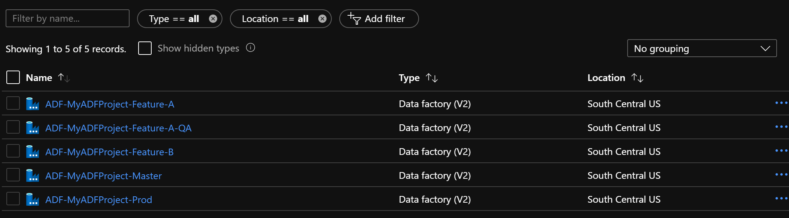

# Azure-Data-Factory-CI-CD-Source-Control
How do to CI/CD with Azure Data Factory.  Lots of customers have asked how to have many feature branches with ADF and here is an apporach.  By defautl ADF uses the GitHub Flow technique for managing ADF, but most of my customers want Git Flow (feature branches with different deployments).  See this [link](https://lucamezzalira.com/2014/03/10/git-flow-vs-github-flow/ "(link)") for Git Flow versus GitHub Flow .

The current issue is how ADF handles generating the ARM templates to deploy your pipelines.  There is only one ADF Publish branch, but if different features are in development, each feature needs to be tested/deploy before merging to the collaboration branch.


Note: When viewing screenshots it is best to right click on open in new tab.

## Create a Master project
1. In Azure create a resource group: ADF-Dev-Ops
2. Create a Data Factory: ADF-MyADFProject-Master 
   - [Click for Screenshot](./images/Create-ADF-MyADFProject-Master.png "screenshot")
   - This will be our master data factory that will be used to Publish our Production data factory ARM templates.
   - Developers will never code here
2. Create a Azure Dev Ops (or GitHub) project: MyADFProject
3. Open the ADF: ADF-MyADFProject-Master 
4. Click on the link to source control
   - [Click for Screenshot](./images/Link-To-Source-Control.png "screenshot")
   - Configure
       - Set the Collaboration branch to **Master**
       - [screenshot](./images/Configure-ADF-MyADFProject-Master-Source-Control.png "Configure-ADF-MyADFProject-Master-Source-Control")
5. Download these three files
   - [Create-ADF-Parameters.json](./Support-Files/Create-ADF-Parameters.json "Create-ADF-Parameters.json") 
   - [Create-ADF-Template.json](./Support-Files/Create-ADF-Template.json "Create-ADF-Template.json") 
   - [Deploy-ADF.ps1](./Support-Files/Deploy-ADF.ps1 "Deploy-ADF.ps1") 
      - The latest script is here: https://docs.microsoft.com/en-us/azure/data-factory/continuous-integration-deployment#script
   - Place them in a folder named "Support-Files"
6. In your Git repo
   - Create a folder named "Support-Files"
   - Upload the 3 files into the folder.
7. Download the Azure Dev Ops Pipeline file that will do our deployment
   - [azure-pipelines.yml](./azure-pipelines.yml "azure-pipelines.yml") 
8. In your Git Repo
   - Upload azure-pipelines.yml to the root (not in a folder)
- Summary
   -  We have created the master branch, linked to source control, have uploaded 3 files which will be used for our deployments and now have a dev ops pipeline.  The 3 support files contains the ARM template to create a new ADF resource in Azure and a ADF specific deployment script.

## Create a Feature-A Branch
1. In source control create a new branch from master called: Feature-A [screenshot](./images/Create-Feature-Branch-A.png "Create-Feature-Branch-A")
2. Create a Data Factory: ADF-MyADFProject-Feature-A
   - [Click for Screenshot](./images/Create-ADF-MyADFProject-Feature-A.png "screenshot")
   - This will be used for coding our data factory
4. Click on the link to source control
   - [Click for Screenshot](./images/Link-To-Source-Control.png "screenshot")
   - Configure
       - Set the Collaboration branch to **Feature-A**
       - [screenshot](./images/Link-ADF-Feature-A-To-Git.png "Link-ADF-Feature-A-To-Git")
       - Note: You do not need to import resources since there are none at this point.  The only resources should be from master.
4. Click on the pencil icon to create a pipeline
5. Select Feature-A as your working branch [screenshot](./images/Select-Feature-A-Branch.png "Select-Feature-A-Branch")
6. Create a pipeline named "feature-a-test-pipeline"
7. Add a Wait activity.  This is just a test pipeline.
8. Click Save All 
9. Go into source control under branch "Feature-A" and you should see your code [screenshot](./images/Feature-A-Code.png "Feature-A-Code")
10. In ADF click the "Publish" button [screenshot](./images/Publish-Feature-A.png "Publish-Feature-A")
11. Go into source control under branch "adf_publish" and you will see your genereated ARM templates under a folder call "ADF-MyADFProject-Feature-A" [screenshot](./images/ADF-Publish-Source-Control-Feature-A.png "ADF-Publish-Source-Control-Feature-A")
- Summary
   -  We have created a development Feature A environment.  This is where we will develop our data factory pipelines.

## Create a Feature-B Branch
- You may create a Feature-B branch by doing the same steps are above.  This is optional for now.

## Decision for QA Environment
- We now want to deploy to QA
- We could have single QA environment (e.g. ADF-MyADFProject-**QA**) or we could have a QA environment (ADF-MyADFProject-Feature-A-**QA**)
- The single QA environment means we only have one place to test our features in UAT/QA
- The QA environment per Feature means we can have as many as we want for testing purposes
- At this point in time we many not know if feature-a or feature-b will be released first to production
- A possible issue with having a mulitple feature QA environments might be conflicts.  Pipeline-1 in feature A and B might run at the 8 PM and could collide.  Or if you have triggers you might run into collisions.
- Personally, I prefer multiple QA environments.

## Deploy Feature A branch to QA
- We will have a QA environment per feature branch in the example.
- Update Feature A branch with any changes (or hotfixes) from Master (Prod)
- We will merge Master back into our Feature-A branch in case any changes in Master has occurred
    One time commands
    ```
    cd \
    git clone git@ssh.dev.azure.com:v3/paternostromicrosoft/MyADFProject/MyADFProject
    ```
    Subsequent times
    ```
    cd MyADFProject
    git checkout master
    git pull
    git checkout Feature-A
    git pull
    git merge master
    git push
    ```
- Manually publish the ADF
  - In the Data Factory UI click on the publish button (just as you did before).  You do not need to do this if nothing was merged from Master    

## To Deploy to QA
- Open your Azure Dev Ops Project
- Click on Pipelines | Pipelines
- Click the on pipeline "MyADFProject" [screenshot](./images/Azure-Dev-Ops-Pipeline.png "Azure-Dev-Ops-Pipeline")
- Click on Run
  - Set the branch to Feature-A
  - Set the ADF: ADF-MyADFProject-Feature-A-QA
     - This the new ADF that will get created in Azure (if it exists nothing will happen)
     - If you want just a single QA name it: ADF-MyADFProject-QA
  - Set the ADF Publish Folder Name in Git: ADF-MyADFProject-Feature-A
     - This is the name of the folder in the adf_publish git branch
     - It could be a set based upon other values, but the name is case-sensitive
  - The default parameters will look like this: [screenshot](./images/Deploy-Feature-A-To-QA-Default-Parameters.png "Deploy-Feature-A-To-QA-Default-Parameters")
  - The updated parameters will look like this: [screenshot](./images/Deploy-Feature-A-To-QA-Specified-Parameters.png "Deploy-Feature-A-To-QA-Specified-Parameters")
- Now run it
   - What is happening
   - The files in the Git repo are being packaged up into build artifacts.  I know we are compiling code, but I like to package my items up to keep things consistent with how I do code.
   - A data factory will be created named "ADF-MyADFProject-Feature-A-QA".  We just did infrastructure as code.
   - The data factory will have triggers disabled
   - The pipelines will be deployed (and connections, dataset, etc)
   - The data factory will have the triggers enabled and any old pipelines artifacts will be deleted
   - An environment in Azure Dev Ops has been created named "QA"

# QA was tested successfully, let's deploy to Prod
- If everything is good with Feature-A we now will deploy to prod
- If there needs to be changes, just make the changes in feature A, publish and use the Azure pipeline to deploy
- To deploy to Production we need to merge the changes to the Master branch
    ```
    git checkout Feature-A
    git pull
    git checkout master
    git pull
    git merge Feature-A
    git push
    ```
- Manually publish the ADF
  - In the Data Factory UI click on the publish button (make sure you are on the master branch)
  - Even though we merged to master we still need to generate the ARM templates.
  - We are ASSUMING nothing in master has changed.  If a hotfix was performed, that should have been merged to the Feature-A branch and new QA deployment peformed.

- Now re-run the Azure pipeline
  - Set the branch to Master
  - Set the ADF: ADF-MyADFProject-Prod
     - This the new ADF that will get created in Azure (if it exists nothing will happen)
     - We only have one production ADF
  - Set the ADF Publish Folder Name in Git: ADF-MyADFProject-Master
     - This is the name of the folder in the adf_publish git branch
     - It could be a set based upon other values, but the name is case-sensitive
  - The default parameters will look like this: [screenshot](./images/Deploy-Master-To-Prod-Default-Parameters.png "Deploy-Master-To-Prod-Default-Parameters")
  - The updated parameters will look like this: [screenshot](./images/Deploy-Master-To-Prod-Specific-Parameters.png "Deploy-Master-To-Prod-Specific-Parameters")

- The data factory should now be deployed to Prod

-  You should now merge Master to Feature-B so that Feature-B gets the changes performed in the Feature-A branch
    ```
    cd MyADFProject
    git checkout master
    git pull
    git checkout Feature-B
    git pull
    git merge master
    git push
    ```

## Azure
- In Azure you will have resource that look like the below.  Some companies will deploy QA and Prod to different subscriptions which is fine.  You will need to change your subscription and connection when running the Dev Ops Pipeline (Parameters: Azure Subscription Id and Azure Resource Connection Name).


## Hoxfixes 
- A hotfix branch can be created off of master (e.g. Hotfix)
- A data factory for the hotfix can be created (e.g. ADF-MyADFProject-Hotfix)
- You can then test the fix
- When tested, merge back to Master and then Publish and then deploy
- Merge Master to Feature-A, Feature-B, etc. to push the change to your feature branches

## Overall Considerations
- Do not edit the same pipeline in two feature branches.
- You are merging JSON not source code.  If you have an activity in a pipeline call Activity-A and you add a Activity-B and link A to B, then in another branch link Activity-A to Activity-C, when you merge, no source control system will link Activity-A to B to C.  Or should it be A to C to B...
